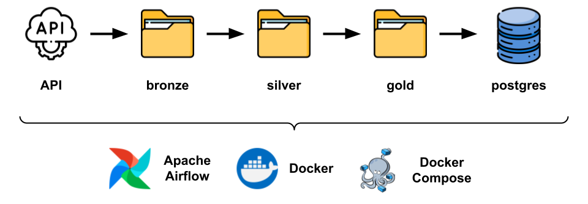

# Breweries Project

## Summary
- [Description](#description)
- [Project Structure](#project-structure)
- [Instructions](#instructions)

<br>

## Description

The Breweries Project is an pipeline designed to extract, process and store brewery data from an external API. The project utilizes Apache Airflow to orchestrate the data pipeline, ensuring that each step is executed in a reliable and repeatable manner.

Tools:
- VSCode: Code editor used for development.
- Git/GitHub: Version control and collaboration.
- Docker: Containerization for consistent environments.
- Postgres: Relational database to persist the aggregated data.
- Airflow: Workflow management tool for scheduling and monitoring the ETL process.
- Python 3.9: Programming language used for the development.

<br>

## Project Structure

The project consists on the following pipeline:



The ETL process begins by extracting data from an external API, storing it in three stages (bronze, silver, and gold), and finally loading it into a PostgreSQL database. Apache Airflow orchestrates the entire pipeline, managing the flow from extraction to transformation and loading.
- API: The data is fetched from an external source using requests in a Python script.
- Bronze: Raw data is saved in JSON format. More details [here](docs/bronze_data.md).
- Silver: Transformed data is stored. More details [here](docs/silver_data.md).
- Gold: Aggregated and final data is stored here. It's an aggregated table with the quantity of breweries per type and location. More details [here](docs/gold_data.md).
- Postgres: The aggregated data is loaded into the PostgreSQL database for further use. More details [here](docs/postgres_data.md).

The project structure is organized as follows:

```python
breweries/
├── dags/                      # Airflow DAG files
│   └── brewery_pipeline.py     # Main ETL DAG
├── data/                      # Data lake architecture
│   ├── bronze/                 # Raw data storage
│   ├── silver/                 # Transformed data storage
│   └── gold/                   # Aggregated data storage
├── docs/                      # Extra documentations about the data
├── images/                    # Images used on readme
├── logs/                      # Logs for task executions in Airflow
├── scripts/                   # Scripts for Airflow setup
│   └── airflow-entrypoint.sh   # Entrypoint script for Airflow
├── requirements.txt           # Project dependencies
├── .env                       # Environment variables for database configuration
├── Dockerfile                 # Dockerfile for Airflow and dependencies
├── docker-compose.yml         # Docker Compose configuration for services
└── README.md                  # Project documentation
```

<br>

## Instructions

In this section, you'll find all the instructions you need to reproduce this project on your own machine.

### Dependencies and recommendations

Before running the project, ensure you have the following installed:
- Docker: If you want to run Airflow and Postgres in containers. You can download it [here](https://docs.docker.com/get-started/get-docker/). If you encounter a WSL error when launching Docker on your machine, I recommend checking [this link](https://stackoverflow.com/questions/66091744/docker-failed-to-start).

The project was developed on Windows 10 and used VSCode.

### Step-by-step

1. Fork and clone the repository: On the GitHub page of the repository, click on the "Fork" button in the upper right corner to create your own copy of the project. Then, clone your forked repository:
```
git clone https://github.com/<your_username>/breweries.git
```

2. Open the Docker Desktop. 

3. Build and start the services: Change to your project directory and run the following command in the terminal to build the Docker containers and start the services:
```
docker-compose up --build
```

4. Check active containers: After the services are up and running, you can check the status of the containers with:
```
docker-compose ps
```
This will display a list of active containers and their status.

5. Access Airflow web interface: Open your web browser and go to http://localhost:8080/. You will see the Apache Airflow login page. Use the following credentials to log in:
- Username: Admin
- Password: admin
You can change these credentials in the airflow-entrypoint.sh file if desired.

6. Run the DAG: Upon logging into Airflow, you will see the brewery_pipeline DAG in the interface. If it’s not running automatically, you may need to trigger it manually. Click the "Play" button to start the DAG execution. You can monitor the progress and troubleshoot any issues by checking the logs, which can be viewed directly in the Airflow interface or in the logs folder that is created within the project directory.

7. Verify the Data: After running the DAG, you can check the data in the bronze, silver, and gold folders that were created during the process. Additionally, you can access the data stored in the PostgreSQL database using the following commands in your terminal:
```
# Access the PostgreSQL database
docker exec -it <postgres_container_name> psql -U brewery_airflow -d brewery_airflow

# List the tables in the database
\dt

# Query the breweries table
SELECT * FROM breweries LIMIT 10;
```
You can change the PostgreSQL database configurations in the docker-compose.yml and .env files if desired.